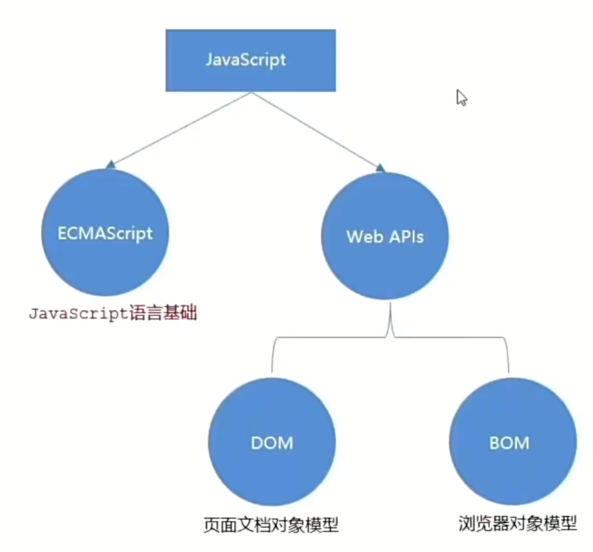

## JavaScript
1. JS简介
    
    * JavaScript是什么？是一种运行在客户端(浏览器)的编程语言,实现人机交互收果。
        * ECMAScript
        * Web APIs
            * DOM 操作文档，比如对页面元素进行移动、大小、添加删除等操作
            * BOM 操作浏览器，比如页面弹窗,检测窗口宽度、存储数据到浏览器等等
        * 作用
            * 网页特效
            * 表单验证
            * 数据交互
            * 服务端变成（node.js）
    * JavaScript书写位置
2. 变量
3. 常量
4. 数据类型